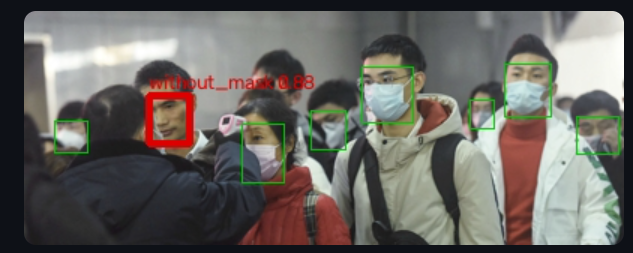
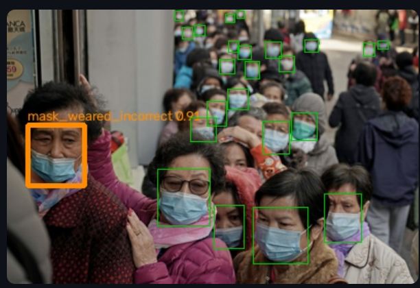
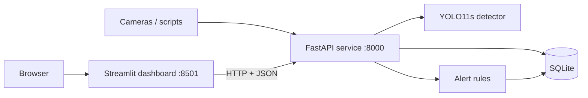

# Safety Vision API


An end-to-end computer vision service that detects mask compliance in images, logs every detection to a database, and raises rule-based alerts per location, with a monitoring dashboard on top.

It covers the full lifecycle: data analysis, label cleaning, a controlled ablation study, honest test-set evaluation, error analysis, a REST API, alerting, Docker deployment and CI.

| Detect | Detect |
| --- | --- |
|  |  |

---

## Results at a glance

| Metric (held-out test set) | Baseline YOLO11n | Final YOLO11s |
| --- | --- | --- |
| mAP50 (all classes) | 0.819 | **0.880** |
| mAP50-95 (all classes) | 0.561 | **0.599** |
| without_mask mAP50 | 0.877 | **0.940** |
| mask_weared_incorrect mAP50 (3% class) | 0.627 | **0.730** |
| Inference, RTX 4060 Laptop GPU (warm) | | about 10 ms |
| End-to-end API latency, GPU (steady load) | | about 12 to 14 ms |
| Inference in CPU Docker container | | about 130 ms |

---

## Architecture



- **FastAPI** is the single backend: input validation, inference, persistence and alerting. Any client (the dashboard, a script, a camera system) uses the same endpoints.
- **Streamlit** is a separate frontend that only talks to the API. The API returns box coordinates; the dashboard decides how to draw them.
- **Docker Compose** runs both as containers on a private network, with the database on a named volume.

### Endpoints

| Method | Path | Purpose |
| --- | --- | --- |
| GET | `/health` | Liveness check and inference device |
| POST | `/predict` | Upload an image (and a `location`); returns detections, counts, violations, latency and any alerts fired |
| GET | `/alerts?limit=20` | Most recent alerts |
| GET | `/stats?location=icu&minutes=60` | Faces, violations and violation rate for a location over a time window |
| GET | `/docs` | Interactive Swagger documentation |

---

## Quick start

The only requirement is [Docker Desktop](https://www.docker.com/products/docker-desktop/).

```bash
git clone https://github.com/rakshitha-hm/safety-vision-api.git
cd safety-vision-api
docker compose up --build
```

Then open:

- Dashboard: http://localhost:8501
- API docs: http://localhost:8000/docs

The first build takes about 5 minutes. The default image uses CPU PyTorch so it runs on any machine.

Example request:

```bash
curl -X POST -F "file=@your_image.png" -F "location=ward_1" http://localhost:8000/predict
```

---

## Dataset

[Face Mask Detection (Kaggle)](https://www.kaggle.com/datasets/andrewmvd/face-mask-detection): 853 images, Pascal VOC XML annotations, 3 classes. See the dataset page for its license. The dataset is not included in this repository.

Exploratory analysis ([notebooks/01_explore.ipynb](notebooks/01_explore.ipynb)) shaped every later decision:

| Finding | Decision it drove |
| --- | --- |
| Class split 79.4% / 17.6% / 3.0% (26:1 imbalance) | Track per-class recall and mAP, not accuracy; stratified split |
| Median face only 18 to 31 px wide | Small-object difficulty; image size tested in ablation |
| Median 2 faces per image, max 115 | Crowded scenes skew the distribution |
| 5 annotation files with no faces | Kept as background images to reduce false positives |

---

## Pipeline

1. **Label cleaning and conversion** ([src/prepare_data.py](src/prepare_data.py)): clips out-of-image boxes, drops degenerate boxes, converts Pascal VOC to normalized YOLO format. Verified by drawing converted labels back onto images.
2. **Stratified split** ([src/split_data.py](src/split_data.py)): 70 / 15 / 15 at image level (no face from one image in two splits), stratified on each image's rarest class, fixed seed, with an assertion that fails on any leakage.
3. **Training** ([src/train.py](src/train.py)): transfer learning from COCO-pretrained YOLO11, 50 epochs, image size 640.
4. **Ablation study** ([src/compare_runs.py](src/compare_runs.py)): one change at a time, all compared on the same validation set.
5. **Final evaluation** ([src/evaluate.py](src/evaluate.py)): model chosen first, then evaluated once on the test set.
6. **Error analysis** ([src/error_analysis.py](src/error_analysis.py)): IoU matching of every prediction to ground truth.

### Ablation study (validation set, 18 rare-class faces)

| Run | Change | mAP50 | mAP50-95 | Rare-class recall | Inference (ms) |
| --- | --- | --- | --- | --- | --- |
| baseline | YOLO11n, 640 px | 0.805 | 0.557 | 0.444 | 4.8 |
| oversample | Rare-class images repeated 4x in train | 0.836 | 0.562 | 0.667 | 4.8 |
| **yolo11s** | **Larger model** | **0.882** | **0.615** | **0.833** | 7.0 |
| yolo11s + oversample | Both | 0.880 | 0.613 | 0.667 | 7.6 |

- The larger model gave the biggest gain; oversampling helped the small model at no speed cost.
- The two fixes did not stack, so the simpler setup (YOLO11s alone) was chosen.
- A 960 px run was interrupted by GPU memory limits and is not reported.

### Test set evaluation

| Model | Class | Precision | Recall | mAP50 | mAP50-95 |
| --- | --- | --- | --- | --- | --- |
| baseline | all | 0.837 | 0.775 | 0.819 | 0.561 |
| final | with_mask | 0.962 | 0.890 | 0.968 | 0.663 |
| final | without_mask | 0.935 | 0.898 | 0.940 | 0.623 |
| final | mask_weared_incorrect | 0.817 | 0.556 | 0.730 | 0.510 |
| final | **all** | **0.905** | **0.781** | **0.880** | **0.599** |

Test mAP50 (0.880) matches validation (0.882), so the model generalizes. The large validation recall gain on the rare class did not transfer to test: with 18 instances, one face moves recall by 5.6 points, and model selection on validation makes its scores optimistic.

### Error analysis (test set, confidence 0.25, IoU 0.5)

| True class | Faces | Correct | Wrong class | Missed |
| --- | --- | --- | --- | --- |
| with_mask | 501 | 467 (93%) | 4 | 30 |
| without_mask | 88 | 82 (93%) | 0 | 6 |
| mask_weared_incorrect | 18 | 11 (61%) | 4 | 3 |

| Outcome | Median face width |
| --- | --- |
| correct | 22.5 px |
| wrong class | 21.0 px |
| missed | 12.0 px |
| false alarm | 9.4 px |

Two distinct failure modes: **missed detections and false alarms concentrate on tiny faces** (a resolution problem), while **wrong-class errors happen at normal sizes** (an ambiguity problem: a mask below the nose sits between the two other classes). Some false alarms are likely unlabelled background faces.

---

## Alerting

Every prediction, its detections and any alerts are written in a single database transaction. A violation is a `without_mask` or `mask_weared_incorrect` detection.

| Rule | Fires when | Safeguards |
| --- | --- | --- |
| `multiple_violations` | 2 or more violations in one image | 10-minute cooldown per location |
| `high_violation_rate` | More than 20% of faces in the last 60 minutes at a location are violations | Minimum sample size; 10-minute cooldown |

A simulation of 60 test images across three locations ([src/simulate_traffic.py](src/simulate_traffic.py)) fired 5 alerts, with an overall violation rate of 19.8%, matching the dataset's 20.6%. The cooldown suppressed repeat alerts. One rate alert fired on only 13 faces, which identified the minimum sample size as the key setting for false alarms.

---

## Engineering notes

- **Latency profiling.** The API first measured about 52 ms per request against a 12 ms benchmark. Profiling each stage showed inference ran on the GPU, and the gap came from the laptop GPU's power states on sporadic requests; under steady load it serves in about 12 to 14 ms.
- **Configuration by environment variables** (`MODEL_PATH`, `DB_PATH`, `API_URL`), so the same code runs locally, in Docker and in tests.
- **Docker.** CPU PyTorch keeps the API image at 2.4 GB and portable; the dashboard image (1 GB) has no PyTorch. Requirements are installed before code is copied, so code-only rebuilds take seconds.
- **Security.** Parameterized SQL queries throughout; input validation returns 400, 415 and 422 instead of server errors.

---

## Testing and CI

```bash
pip install -r requirements-dev.txt
pytest -v
```

- **Unit tests:** VOC to YOLO conversion, box cleaning, violation counting.
- **Database and rule tests:** each test uses its own temporary database; covers thresholds, cooldown, minimum sample size and per-location independence.
- **API tests:** FastAPI `TestClient` checks the response contract and every error path, using a generated image (no dataset needed).

GitHub Actions runs the tests on every push and pull request, then builds both Docker images only if the tests pass.

---

## Local development

```bash
python -m venv .venv
.venv\Scripts\activate            # Windows
# Install PyTorch first, choosing CUDA or CPU at https://pytorch.org/get-started/locally/
pip install -r requirements.txt

python -m uvicorn app:app --app-dir src --reload      # API on :8000
python -m streamlit run src/dashboard.py              # dashboard on :8501
```

Reproduce the training pipeline (dataset downloaded into `data/`):

```bash
python src/prepare_data.py
python src/split_data.py
python src/train.py --model yolo11s.pt --name exp_yolo11s
python src/evaluate.py
python src/error_analysis.py
```

---

## Project structure

```
safety-vision-api/
├── src/
│   ├── prepare_data.py       # label cleaning, VOC to YOLO
│   ├── split_data.py         # stratified split, data.yaml
│   ├── train.py              # training CLI
│   ├── oversample.py         # rare-class oversampling list
│   ├── compare_runs.py       # ablation comparison
│   ├── evaluate.py           # test-set evaluation
│   ├── error_analysis.py     # IoU matching and failure slicing
│   ├── detector.py           # model wrapper
│   ├── app.py                # FastAPI service
│   ├── database.py           # SQLite schema and queries
│   ├── alerts.py             # alert rules
│   ├── dashboard.py          # Streamlit frontend
│   ├── simulate_traffic.py   # synthetic traffic
│   └── latency_check.py      # latency client
├── tests/                    # pytest suite
├── notebooks/                # EDA, label checks, SQL queries
├── models/mask_detector.pt   # final YOLO11s weights
├── docs/                     # screenshots
├── Dockerfile.api
├── Dockerfile.dashboard
├── docker-compose.yml
└── .github/workflows/ci.yml
```

---

## Limitations and next steps

- Recall on incorrectly worn masks (0.556 on 18 test faces) is the main weakness; more labelled examples of this class are the real fix.
- Tiny faces under about 12 px are often missed; tiling or higher-resolution input for crowded scenes would help.
- The default container runs on CPU (about 130 ms per image); a GPU image or an optimized model (ONNX, OpenVINO, quantization) is needed for real-time camera loads.
- SQLite suits a single node; PostgreSQL would be the choice for many concurrent writers.

---

## Tech stack

Python, OpenCV, Pandas, NumPy, PyTorch, Ultralytics YOLO11, scikit-learn, FastAPI, Uvicorn, SQLite, Streamlit, Docker, Docker Compose, pytest, GitHub Actions.
